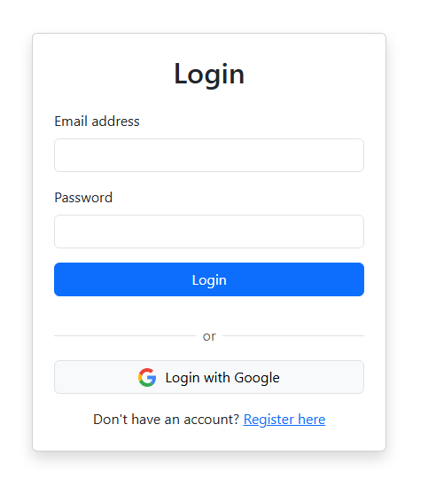
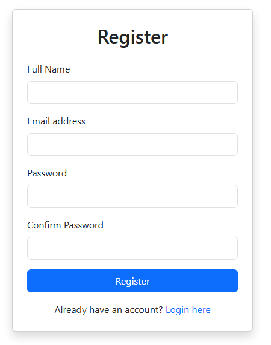
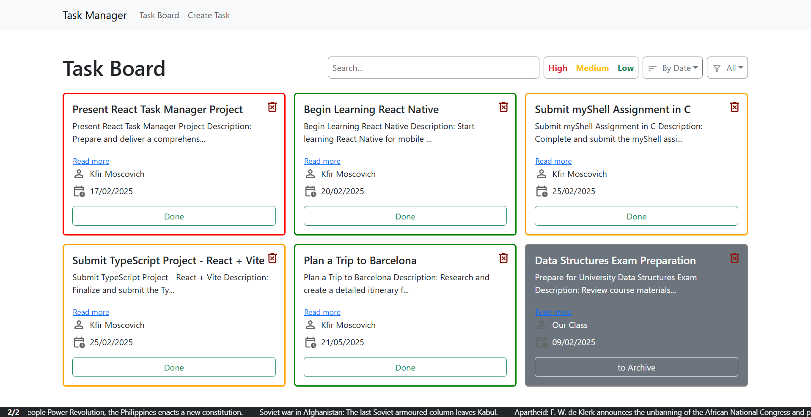
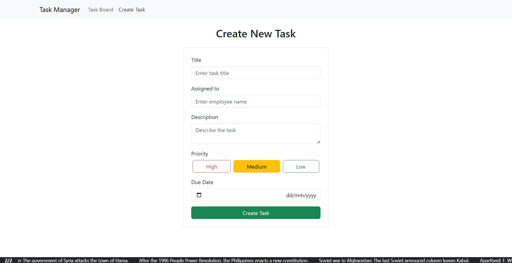
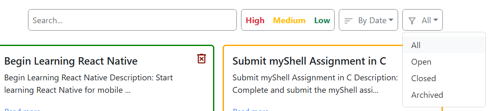
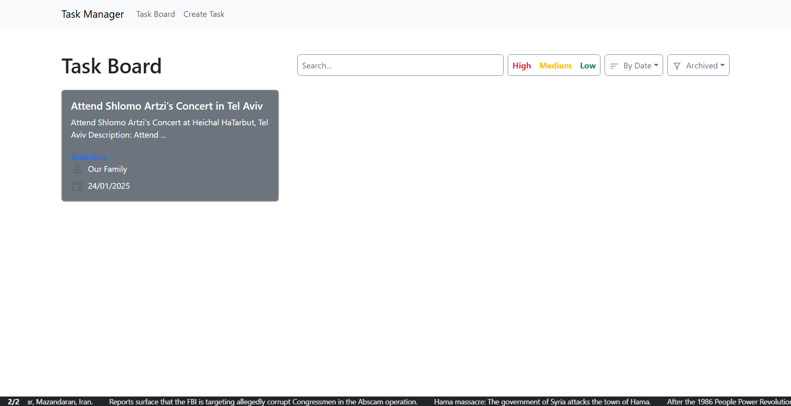
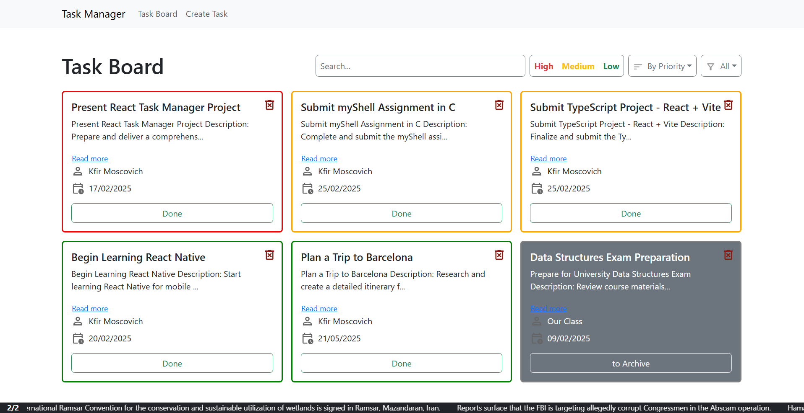

# כפיר מוסקוביץ | תיעוד פרויקט

## סקירה כללית של הפרויקט
פרויקט זה הוא אפליקציה לניהול משימות שנבנתה באמצעות React. האפליקציה מאפשרת למשתמשים ליצור, לצפות ולנהל את המשימות שלהם בצורה יעילה. האפליקציה מחוברת ל-Firebase לניהול מסד נתונים בזמן אמת ותומכת באימות משתמשים.

## תכונות עיקריות
- **יצירת משימה**: משתמשים יכולים להוסיף משימות חדשות באמצעות טופס ייעודי.
- **סינון ומיון משימות**: תפריט בקרה שמאפשר לסנן משימות לפי סטטוס המשימה ולמיין אותן לפי עדיפויות.
- **לוח משימות**: מציג את כל המשימות בצורה מאורגנת עם אפשרויות למחיקה, סימון כהושלמה, או העברה לארכיון.
- **מחיקת משימה**: משתמשים יכולים למחוק משימות ישירות מהלוח עם אפשרות לבטל מחיקה.
- **עדכונים בזמן אמת**: האינטגרציה עם Firebase מבטיחה שכל הנתונים מסונכרנים בזמן אמת.
- **ניהול משתמשים**: תמיכה בהרשמה, כניסה ויציאה באמצעות Firebase Authentication.

## רכיבים ומהותם
### קבצים כלליים
- **`App.js`**: הרכיב הראשי שמחבר את כל שאר הרכיבים, מנהל את הניווט בין הדפים, ומטפל באימות המשתמשים.
- **`index.js`**: נקודת הכניסה הראשית של האפליקציה שבה React מטעין את רכיב ה-`App`.

### רכיבים
- **`CreateTaskForm.jsx`**
  - רכיב טופס ליצירת משימות חדשות.
  - כולל שדות קלט לשם המשימה, תיאור, למי מוקצה, תאריך יעד ורמת עדיפות.
  - פונקציות עיקריות:
    - `handleSubmit` - מטפלת בשליחת הטופס, שומרת את הנתונים ב-Firebase.
    - `handleChange` - מעדכנת את ה-state עם הערכים שהמשתמש מכניס.
  - **Hooks בשימוש**: `useState` לניהול מצב הטופס.

- **`Controls.jsx`**
  - רכיב בקרה לסינון ומיון משימות.
  - מאפשר למשתמשים לסנן משימות לפי סטטוס ולמיין לפי עדיפויות.
  - פונקציות עיקריות:
    - `handleFilterChange` - משנה את הקריטריון לפיו מסננים את המשימות.
    - `handleSortChange` - משנה את הסדר שבו מוצגות המשימות.
  - **Hooks בשימוש**: `useState` לניהול ערכי הסינון והמיון.

- **`History.jsx`**
  - רכיב להצגת מידע היסטורי מאת ה-API.
  - פונקציות עיקריות:
    - `fetchHistoricalEvents` - שולפת אירועים היסטוריים מה-API.
  - **Hooks בשימוש**: `useEffect` לטעינת הנתונים בעת טעינת הרכיב.

- **`TaskBoard.jsx`**
  - מציג את כל המשימות בלוח.
  - משולב עם Firebase לשליפת נתונים ועדכון המשימות בזמן אמת.
  - פונקציות עיקריות:
    - `fetchTasks` - שולפת את כל המשימות מ-Firebase.
    - `deleteTask` - מוחקת משימה ספציפית מ-Firebase עם אפשרות לביטול.
    - `markAsDone` - מסמנת משימה כהושלמה.
    - `archiveTask` - מעבירה משימה לארכיון.
  - **Hooks בשימוש**: `useEffect` לטעינת נתונים, `useState` לניהול המשימות.

- **`TaskItem.jsx`**
  - מייצג משימה יחידה עם אפשרויות מחיקה, סימון כהושלמה או העברה לארכיון.
  - פונקציות עיקריות:
    - `handleDelete` - מוחקת את המשימה מ-Firebase.
    - `handleMarkAsDone` - מסמנת משימה כהושלמה.
    - `handleArchive` - מעבירה משימה לארכיון.
  - **Hooks בשימוש**: `useState` לניהול מצב משימה.

- **`Login.jsx`**
  - רכיב לטיפול בתהליך הכניסה למערכת.
  - כולל שדות קלט לדוא"ל וסיסמה.
  - פונקציות עיקריות:
    - `handleLogin` - מטפלת בשליחת פרטי הכניסה ומבצעת אימות מול Firebase.
  - **Hooks בשימוש**: `useState` לניהול פרטי המשתמש, `useNavigate` לניווט לאחר הכניסה.

- **`Register.jsx`**
  - רכיב לרישום משתמשים חדשים.
  - כולל שדות קלט לשם משתמש, דוא"ל וסיסמה.
  - פונקציות עיקריות:
    - `handleRegister` - מטפלת ביצירת חשבון חדש ושומרת את הנתונים ב-Firebase.
  - **Hooks בשימוש**: `useState` לניהול פרטי ההרשמה, `useNavigate` לניווט לאחר ההרשמה.

### אינטגרציה עם Firebase
- **`api.js`**: מכיל פונקציות לשליפה ועדכון של נתונים מ-API, כולל שליפת אירועים היסטוריים.
- **`connections.js`**: מכיל את ההגדרות והחיבורים של Firebase ומטפל בביצוע קריאות ל-Database.
- **`firebase.js`**: מטפל באינטראקציה עם Firebase, כולל Authentication ושליפת נתוני משימות.
- **`auth.js`**: מנהל את תהליך האימות של המשתמשים.

### עיצוב
- **`App.css`, `index.css`**: עיצובים כלליים לאפליקציה.
- **`History.css`**: עיצוב ייעודי להיסטוריית המשימות.

## טכנולוגיות בשימוש
- **React**: לבניית ממשק המשתמש.
- **Firebase**: לניהול מסד נתונים בזמן אמת ואימות משתמשים.
- **CSS**: לעיצוב הרכיבים.
- **React Router**: לניווט בין דפים באפליקציה.
- **Bootstrap**: לעיצוב ממשק המשתמש.

## התקנות בפרויקט
- **@babel/core, @babel/preset-env, @babel/preset-react**: לניהול קוד JavaScript ו-React.
- **@firebase/app, firebase**: חיבור ל-Firebase.
- **bootstrap, react-bootstrap**: לעיצוב ממשק המשתמש.
- **cra-template**: תבנית יצירת פרויקט React.
- **dotenv**: לניהול משתני סביבה.
- **polyfill**: תמיכה בדפדפנים ישנים.
- **react, react-dom, react-scripts**: ספריות React.
- **react-router-dom**: לניווט באפליקציה.
- **react-app-rewired**: לשינוי קונפיגורציית Webpack.
- **web-vitals**: למדידת ביצועים.

## איך להריץ את הפרויקט
1. להריץ `npm install` כדי להתקין את כל התלויות.
2. להפעיל את האפליקציה עם `npm start`.
3. לפתוח את `http://localhost:3000` בדפדפן.

---

## תמונות

